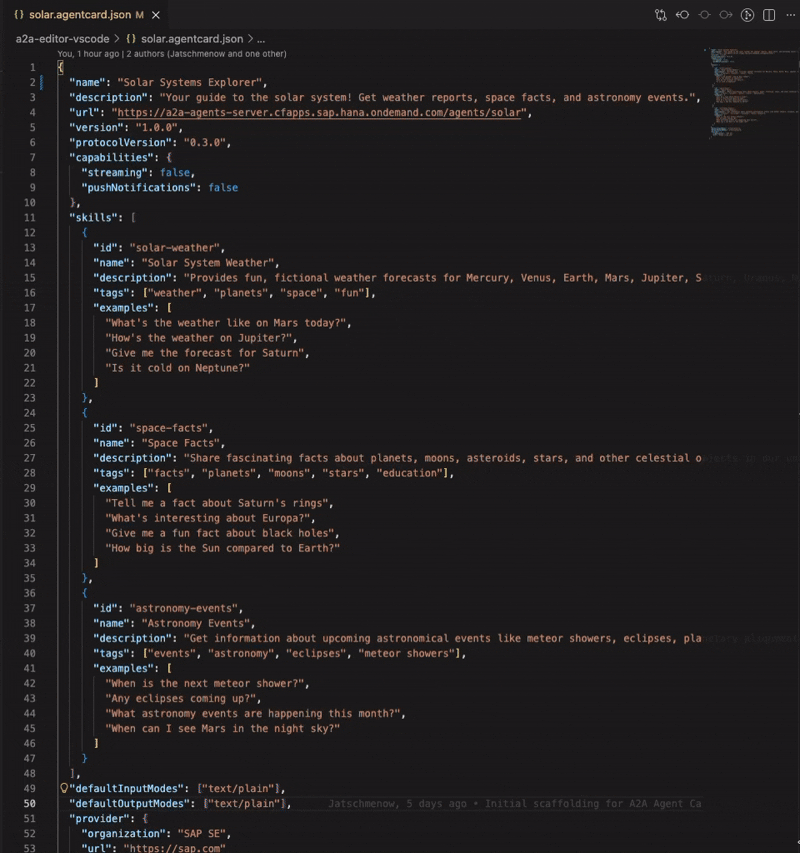

[](https://marketplace.visualstudio.com/items?itemName=open-resource-discovery.a2a-editor-vscode) [](https://marketplace.visualstudio.com/items?itemName=open-resource-discovery.a2a-editor-vscode) [](LICENSE)

# A2A Editor for VSCode

Visual editor for [A2A (Agent-to-Agent)](https://a2a-protocol.org) protocol Agent Cards inside VS Code. Browse, edit, validate, and test your agents without leaving your IDE.

Built on [@open-resource-discovery/a2a-editor](https://github.com/open-resource-discovery/a2a-editor).

## Features

- **Activity Bar Sidebar** — Dedicated A2A icon in the sidebar with auto-detection of agent card files in the active editor
- **Custom Editor** — Open `*.agentcard.json`, `agent-card.json`, or `agent.json` files as rendered, interactive agent cards
- **Agent Overview** — View agent name, version, provider, description, capabilities, skills, and security schemes at a glance
- **Chat & Testing** — Send messages to connected A2A agents and inspect raw HTTP request/response payloads
- **URL Discovery** — Connect to agents via URL with automatic well-known path resolution
- **Authentication** — Built-in support for Basic Auth, Bearer Token, and API Key authentication
- **Theme Integration** — Seamlessly follows VS Code light, dark, and high-contrast themes

## Quick Start

1. Install from the [VS Code Marketplace](https://marketplace.visualstudio.com/items?itemName=open-resource-discovery.a2a-editor-vscode) or run:
   ```
   ext install open-resource-discovery.a2a-editor-vscode
   ```
2. Click the **A2A icon** in the Activity Bar (left sidebar)
3. Enter an agent URL and click **Connect** — or open any agent card JSON file

## Usage

### Sidebar

The sidebar provides a persistent view for browsing agent cards. It automatically detects when the active editor contains an agent card JSON file and switches to display it. Enter a URL to connect to a remote agent, or toggle between URL and file sources.


### Custom Editor

Open any agent card file, then run `Cmd+Shift+P` (macOS) / `Ctrl+Shift+P` (Windows/Linux) → **"A2A: Open Current File as Agent Card"** to open it as a visual agent card. Changes sync bidirectionally between the visual editor and the underlying JSON file.



## Commands

| Command                                | Description                                        |
| -------------------------------------- | -------------------------------------------------- |
| `A2A: Open Current File as Agent Card` | Open the active JSON file in the agent card editor |

## Supported File Patterns

The custom editor activates as an alternative editor (not default) for:

- `*.agentcard.json`
- `agent-card.json`
- `agent.json`

## URL Discovery & Authentication

When connecting to an agent by URL, the extension tries the following paths in order:

1. `<url>/.well-known/agent.json`
2. `<url>/.well-known/agent-card.json`
3. The original URL directly

If the URL ends in `.json`, it is fetched directly without well-known path discovery.

**Supported authentication methods:**

- **No Authentication** — Public agents
- **Basic Auth** — Username and password
- **Bearer Token** — OAuth / JWT tokens
- **API Key** — Custom `X-API-Key` header

<details>
<summary><strong>Development</strong></summary>

### Prerequisites

- [Node.js](https://nodejs.org/) >= 24
- [VS Code](https://code.visualstudio.com/) >= 1.110

### Setup

```bash
git clone https://github.com/open-resource-discovery/a2a-editor-vscode.git
cd a2a-editor-vscode
npm install
npm run compile
```

### Run in Development

1. Open this folder in VS Code
2. Press **F5** to launch the Extension Development Host
3. In the new window, click the **A2A icon** in the Activity Bar or run a command from the palette

### Available Scripts

| Script             | Description                 |
| ------------------ | --------------------------- |
| `npm run compile`  | Build extension and webview |
| `npm run watch`    | Watch mode for both builds  |
| `npm run eslint`   | Run ESLint                  |
| `npm run prettier` | Format code with Prettier   |
| `npm run package`  | Package as `.vsix`          |

</details>

## Contributing

Please see [CONTRIBUTING.md](CONTRIBUTING.md) for details on how to contribute to this project.

## License

Please see our [LICENSE](LICENSE) for copyright and license information. Detailed information including third-party components and their licensing/copyright information is available [via the REUSE tool](https://api.reuse.software/info/github.com/open-resource-discovery/a2a-editor).
